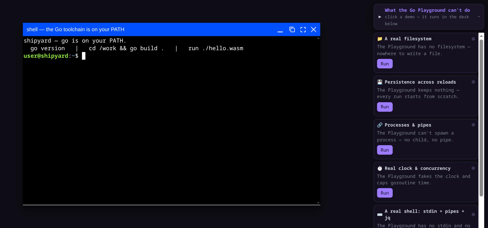
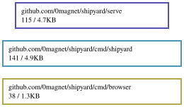

# shipyard — a Go workstation in a browser tab

[bottle](https://github.com/0magnet/bottle) gives a tab an operating system —
a filesystem, a network, processes. [shipwright](https://github.com/0magnet/shipwright)
gives it the Go toolchain. shipyard is where you sit down and use them: a shell
where you type `go build`, on the same in-memory filesystem the compiler reads,
with the browser to view what you make.

**[Live demo](https://0magnet.github.io/shipyard/)** — `go` is already on the PATH; type `cd /work && go build .` and run what comes out, or click a demo to watch it break a Go Playground limitation.



The pieces, and who does what:

- **bottle** — jsfs (files), vnet (loopback network), proc (processes).
- **shipwright** — `cmd/go` + `cmd/compile`/`asm`/`link`, built for js/wasm.
- **websh** — the terminal (a Go/wasm shell on xterm).
- **netscrape** — the browser, for viewing what you serve on the vnet.
- **winbox-go** — the windowing the desk is made of.

## What works today (milestones 1–3)

**A terminal window where you type `go build`.** shipyard opens a websh terminal
in a [winbox](https://github.com/0magnet/winbox-go) window, its shell running
over `afero.NewOsFs()` — which on js/wasm *is* bottle's jsfs — with `go` on its
PATH. Because the shell and the toolchain share one filesystem, and websh execs
a filesystem program as a child wasm process through bottle's proc, the
toolchain runs as an ordinary command you type at the prompt:

    $ go version
    go version go1.27.0 js/wasm
    $ go env GOROOT
    /goroot
    $ cd /work && go build -o hello.wasm .    # compiles fmt/os/runtime from source
    $ go install github.com/0magnet/websh/cmd/websh@main   # fetches + builds a whole tool

The last line is not hypothetical — shipwright already compiles websh from its
whole module graph, fetched over a `/goproxy` passthrough. In shipyard you type
it at a prompt.

`index.html` is the desk: it seeds the toolchain into jsfs, opens the terminal
window, and lets you type. Open it with `#selftest` and it runs the whole demo
gallery headlessly, checking each marker — the headless proof. `demo.html` is
the same wiring without a window (the shell driven through a JS call), kept as
the minimal read. Build and serve with `./build.sh` (see below).

## The gallery — "What the Go Playground can't do"

The desk carries a launcher dock (top right, on both `index.html` and the
static Pages `pages.html`) of small self-contained Go programs, each
demonstrating a capability the Go Playground fundamentally lacks and each
captioned with the limitation it breaks. Every one runs **fully client-side**:
no server, no `/fetch`, no `/goproxy`, no `/std` — so all of them work on static
GitHub Pages. `demos.js` is the single source of truth (the gallery UI and the
`#selftest` harness share it), and each demo confirms its own
`SHIPYARD-<CAP>-MARKER` line:

| Demo | The Playground limitation it breaks |
| --- | --- |
| **Filesystem** (`fs.wasm`) | no filesystem — nowhere to write a file |
| **Persistence** (`jsfs.persist`) | keeps nothing; every run starts from scratch — here a file survives a page reload via IndexedDB |
| **Processes & pipes** (`procparent.wasm` + child) | can't spawn a process — no child, no pipe, no exit code |
| **Real clock & concurrency** (`timeconc.wasm`) | fakes the clock and caps goroutine time — here goroutines finish in real order on the real wall clock |
| **Shell: stdin + pipes + jq** | no stdin and no shell — here `echo … \| jq` is a real pipeline |
| **Go client ↔ Go server over vnet** (`netclient.wasm`) | no network at all — here a Go `net/http` client fetches from a Go `net/http` server, both in-tab, over bottle's virtual loopback |
| **Browse an in-tab server** (netscrape) | can't run a server, a browser, or a network — here the Go/wasm browser renders a page the in-tab server serves over vnet |
| **Graphical animated window** (`gui.wasm`) | text-stdout only — here a Go program draws an animated clock on a `<canvas>` |
| **Compile & run Go in the tab** | compiles one file server-side — here `go build` runs in the tab and the result runs too |
| **Compile & run a test** (`go test -c`) | runs a program, not a test binary — here the toolchain compiles a test binary and proc runs it to `PASS` |

The programs live in one self-contained module (`demo/`, module `demo`) whose
only non-std imports are its own copies of bottle's `vnet` and `proc` drop-ins,
so each builds offline from the seeded standard library. Their source is seeded
at `/work/demo`, viewable and rebuildable in the desk:

    cd /work/demo && go build -o /work/server.wasm ./server && run server.wasm

## How the shell execs the toolchain

websh's exec handler, on js/wasm, resolves an unknown command against the
filesystem PATH and — if it finds a program — spawns it as a child wasm
instance via `globalThis.proc.spawn`, sharing this tab's jsfs and vnet. The
child's stdout/stderr cross through jsfs pipes (plain JS sinks, drained into
the shell after the child exits), so nothing re-enters the shell's Go runtime
mid-execution. `go` is just `go-proc.wasm` parked at `/bin/go`; running it is
instantiating another wasm module.

## Roadmap

- **✓ Milestone 2 — the terminal window.** websh's `web.Session` in a winbox
  window, `go build` typed at the prompt.
- **✓ Milestone 3 — run what you build.** The `run` command spawns a compiled
  wasm program into its own winbox window (its mount element id arrives in
  `$SHIPYARD_MOUNT`), so `go build -o clock.wasm . && run clock.wasm` opens a
  live UI. Headless-verified: build a GUI program in the terminal, run it, and
  a second window draws its output.
- **✓ A browser, in Go.** `cmd/browser` is a web browser written in Go/wasm —
  a netscrape port. Chrome (tabs, address bar, back/forward, reload) is DOM from
  `syscall/js`; each tab is a sandboxed `<iframe>`. It **fetches** pages over a
  pluggable transport (`fetchVia`), **transcodes** them (renders in a sandboxed
  srcdoc, inlines stylesheets as `<style>` and images as `data:` URIs via a
  parent/sandbox relay), and **relays navigation** (a sandboxed page's link and
  form submits drive the browser). `run /work/browser.wasm` opens it in a
  window. Each of fetch, sandbox, navigation, and resource-inlining is
  headless-verified.
  The transport is pluggable (`globalThis.__netscrapeFetch`), so a host can
  route it through its own network; that's an exploration, not a commitment to
  live anywhere in particular — if the shipyard/wasm-visor combination is worth
  shipping, it belongs in its own repo, not folded into either side.
- **✓ In-tab networking — the browser reaches a server over vnet.** The desk
  ships `server.wasm`, a real Go `net/http` server that listens on bottle's
  **vnet** virtual loopback (`vnet.Listen`, a `net.*` drop-in). `run
  server.wasm`, then in the browser open `127.0.0.1:8080`: shipyard's
  `__netscrapeFetch` dials that vnet port with `vnet.httpFetch` and hands the
  bytes back, so the browser renders a page served by another wasm process **in
  the same tab** — no server, no `/fetch` proxy, no network. This is the thing
  the Go Playground cannot do, and it works unchanged on static GitHub Pages.
  The server's source is seeded at `/work/server` (a self-contained module) so
  you can `go build` it in the desk too. Headless-verified end to end
  (`SHIPYARD-VNET-MARKER`), on both the local desk and the static Pages build.
- **✓ Instant reloads.** `index.html` restores the whole workstation —
  toolchain, standard library, and your `/work` — from IndexedDB via
  `jsfs.persist`, so a reload skips the ~100 MB cold seed entirely. The module
  cache persists the same way, so a dependency fetched once stays fetched.
  Verified: a reload restores from cache with no re-seed.
- **Richer transcoding.** Fonts, nested `@import`, and XHR layer onto the same
  resource relay the browser already uses for stylesheets and images.
- **Lazy std.** Seeding is all-of-std up front today; fetching each std package
  only when a build first imports it would shrink the cold seed further.

## Build

    ./build.sh          # builds shipyard.wasm + pulls shipwright's toolchain into web/
    go run ./serve      # http://localhost:8931, static + the /goproxy passthrough

Then open `http://localhost:8931/demo.html`.

## Dependency Graph

Made with [goda](https://github.com/loov/goda):

```
# GOOS=js: the import edges of a wasm program live in js/wasm-tagged
# files and are invisible to a host-context run
GOOS=js GOARCH=wasm go run github.com/loov/goda@latest graph github.com/0magnet/shipyard/... | dot -Tsvg -o docs/shipyard-goda-graph.svg
```



## Lines of Code

Made with [gocloc](https://github.com/hhatto/gocloc) (excludes `vendor/`, `node_modules/`, `.git/`):

```
gocloc --not-match-d='(vendor|node_modules|\.git)' .
```

```
-------------------------------------------------------------------------------
Language                     files          blank        comment           code
-------------------------------------------------------------------------------
Go                              16            130            254            908
JavaScript                       1             12             40            254
HTML                             3             27             53            207
Markdown                         1             22              0            114
Bourne Shell                     2             16             39            103
YAML                             1              0              7             98
-------------------------------------------------------------------------------
TOTAL                           24            207            393           1684
-------------------------------------------------------------------------------
```
